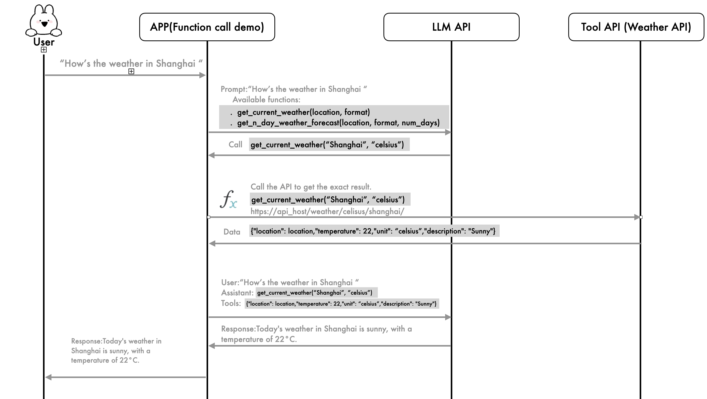

# function calling demo

## Author: wengxiaoxiong

This project demonstrates how to use the OpenAI API to create a language model agent that can interact with external functions, specifically for fetching weather data. The project utilizes the function call feature of the OpenAI API, enabling the language model to make API-like calls to predefined functions to fulfill user requests.

To summarize, when precise data is needed, the large model should not make random guesses(hallucination). Instead, it should use tools to obtain accurate results. These tools can be mathematical functions or external APIs.




## Table of Contents

- [Introduction](#introduction)
- [Installation](#installation)
- [Usage](#usage)
- [Project Structure](#project-structure)
- [Contributing](#contributing)
- [License](#license)

## Introduction

This project showcases the use of function calls in large language models (LLMs) to enhance their capabilities by integrating them with external functions. The demo focuses on weather-related functions, allowing the language model to fetch current weather data and multi-day weather forecasts based on user queries.

The key components include:
- **Function Calls**: Enabling the LLM to call specific functions for data retrieval.
- **Tool Integration**: Defining tools that the LLM can use to perform specific tasks, such as fetching weather data.

## Installation

1. **Clone the repository**:

    ```sh
    git clone https://github.com/wengxiaoxiong/function-calling-demo.git
    cd function-call-demo
    ```

2. **Create and activate a virtual environment** (optional but recommended):

    ```sh
    python -m venv venv
    source venv/bin/activate  # On Windows use `venv\Scripts\activate`
    ```

3. **Install dependencies**:

    ```sh
    pip install -r requirements.txt
    ```

4. **Set up environment variables**:

    - Create a `.env` file in the root directory of the project.
    - Add your OpenAI API key to the `.env` file:

      ```env
      OPENAI_API_KEY=your_openai_api_key
      ```

## Usage

1. **Run the main script**:

    ```sh
    python main.py
    ```

    This script sends a chat request to the OpenAI API and processes the response, including handling any function calls to retrieve weather data.

2. **Modify the request**:

    You can modify the user message or add more messages to the `messages` list in `main.py` to change the query.

## Project Structure

- `chat.py`: Contains the function to handle chat completion requests with retries.
- `tools.py`: Defines the tools (functions) that can be called by the chat completions.
- `functions.py`: Contains mock functions to simulate retrieving weather data.
- `main.py`: The main script that ties everything together and handles the chat and function call flow.

